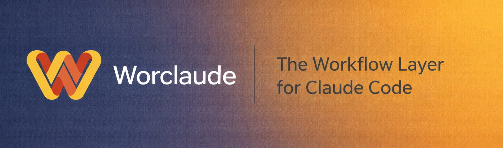

<p align="center">
  
</p>

<p align="center">
  <a href="https://www.npmjs.com/package/worclaude"></a>
  <a href="https://www.npmjs.com/package/worclaude"></a>
  <a href="https://github.com/sefaertunc/Worclaude/actions/workflows/ci.yml"></a>
  <a href="LICENSE"></a>
  = 18" />
  
</p>

<p align="center">
  <a href="https://github.com/sponsors/sefaertunc"></a>
  &nbsp;
  <a href="https://buymeacoffee.com/sefaertunc"></a>
</p>

<p align="center">
  <a href="https://sefaertunc.github.io/Worclaude/">Documentation</a> ·
  <a href="https://www.npmjs.com/package/worclaude">npm</a> ·
  <a href="https://github.com/sefaertunc/Worclaude/issues">Issues</a>
</p>

# Worclaude: The Workflow Layer for Claude Code

Worclaude scaffolds a complete Claude Code workflow into any project in seconds. One `init` command installs 25 agents, 16 slash commands, 17 skills, an 11-event hook layer, local observability capture, a five-layer memory system, and a CLAUDE.md template tuned for your tech stack. It implements the patterns in [howborisusesclaudecode.com](https://www.howborisusesclaudecode.com/) as a reusable, upgradable scaffold, so you stop rebuilding the same configuration for every new project.

<div align="center">

| CLI Commands |          Agents           | Slash Commands |        Skills         |     Hooks      |  Tech Stacks  |
| :----------: | :-----------------------: | :------------: | :-------------------: | :------------: | :-----------: |
|      14      | 6 universal + 19 optional |       16       |          17           |   11 events    |      16       |
| subcommands  |    across 6 categories    | session tools  | universal + templates | 7 hook scripts | auto-detected |

</div>

---

## What You Get

`worclaude init` installs a production-ready Claude Code workflow:

### Agents (25 total)

- **6 universal:** plan-reviewer (Opus), code-simplifier (Sonnet, worktree), test-writer (Sonnet, worktree), build-validator (Haiku), verify-app (Sonnet, worktree), upstream-watcher (Sonnet)
- **19 optional** across 6 categories: Backend, Frontend, DevOps, Quality, Documentation, Data/AI. Worclaude recommends agents based on your project type.

### Slash Commands (16)

Session lifecycle, review, verification, memory, observability, and git automation:

`/start` `/end` `/commit-push-pr` `/review-plan` `/verify` `/compact-safe` `/update-claude-md` `/learn` `/setup` `/sync` `/conflict-resolver` `/review-changes` `/build-fix` `/refactor-clean` `/test-coverage` `/observability`

### Skills (17 total)

- **13 universal**: context-management, git-conventions, planning-with-files, review-and-handoff, prompt-engineering, verification, testing, claude-md-maintenance, coding-principles, subagent-usage, security-checklist, coordinator-mode, memory-architecture
- **3 project templates** filled in automatically by `/setup`: backend-conventions, frontend-design-system, project-patterns
- **1 generated**: agent-routing, dynamically built from your agent selections

Skills use Claude Code's directory format (`skill-name/SKILL.md`) and support **conditional activation** via path globs, so Claude only carries knowledge relevant to the current file.

### Hooks (11 events, 7 hook scripts)

Worclaude scaffolds 14 hook entries across 11 Claude Code events:

- **SessionStart**: auto-loads CLAUDE.md, PROGRESS.md, last session summary, and recent learnings
- **PostToolUse**: auto-formats code after every edit (formatter chosen by stack); strict profile adds a TypeScript check
- **PostCompact**: re-reads key files after context compaction so Claude stays oriented
- **PreCompact**: emergency git snapshot before auto-compaction (`pre-compact-save.cjs`)
- **UserPromptSubmit**: three handlers run in sequence (correction-detection, skill-hint matching, and command-invocation observability capture)
- **Stop**: extracts `[LEARN]` blocks from the transcript and persists them (`learn-capture.cjs`)
- **InstructionsLoaded**: captures skill loads to `.claude/observability/skill-loads.jsonl` (`obs-skill-loads.cjs`)
- **SubagentStart / SubagentStop**: captures agent invocations to `.claude/observability/agent-events.jsonl` (`obs-agent-events.cjs`)
- **SessionEnd / Notification**: quiet-by-default session-end and desktop alerts

Three profiles via `WORCLAUDE_HOOK_PROFILE`: `minimal` (context hooks only; disables observability and notifications), `standard` (all hooks, default), `strict` (standard + TypeScript checking on every edit).

### Observability

A privacy-first per-project signal layer captures skill loads, command invocations, and agent timings to `.claude/observability/*.jsonl` (gitignored). The `worclaude observability` CLI and `/observability` slash command aggregate the signals into a Markdown report: top skills, top commands, agent failure rates, and anomalies. Zero data leaves the machine; opt out via `WORCLAUDE_HOOK_PROFILE=minimal` or by deleting the folder.

### GitHub Action Integration

When `worclaude init` finishes it offers to surface Claude Code's `/install-github-action` flow. If installed, `@claude` mentions in PR comments will automatically propose CLAUDE.md updates, slotting cleanly into the `/sync`-driven release flow. Worclaude itself never shells out to the install command; it just points you at it.

### Learnings System

A personal, gitignored store at `.claude/learnings/` captures corrections and rules Claude picks up mid-session and replays them at the start of future sessions. The `correction-detect.cjs` and `learn-capture.cjs` hooks do this automatically; the `/learn` slash command is the explicit capture path. Unlike CLAUDE.md (shared rules, in git), learnings are yours; useful for personal conventions that should not leak into the repo. Promote a learning to CLAUDE.md when it matures into something every contributor should follow.

### Cross-Tool Compatibility

`AGENTS.md` is scaffolded alongside `CLAUDE.md` as a single source of truth for Cursor, Codex, GitHub Copilot, and other AI coding tools that expect `AGENTS.md`. Switching tools does not require maintaining parallel rule files.

### Doctor

`worclaude doctor` runs a four-category health check: core files (workflow-meta, CLAUDE.md, settings.json), components (agents, commands, skills, agent-routing), documentation (PROGRESS.md, SPEC.md), and integrity (file hashes, hook-event validity, deprecated models, CLAUDE.md line budget, learnings index integrity, gitignore coverage). Every check reports PASS/WARN/FAIL with actionable diagnostics.

### Configuration

Pre-configured permissions per tech stack (Node.js, Python, Go, Rust, and 12 more), a CLAUDE.md template with progressive disclosure via skills, sandbox / effort / output defaults out of the box.

---

## Quick Start

```bash
npx worclaude init
```

Or install globally:

```bash
npm install -g worclaude
cd your-project
worclaude init
```

Follow the interactive prompts to select your project type, tech stack, and agents. Then open Claude Code and run `/setup` to fill in your project-specific content.

For parallel tasks, launch Claude with worktrees:

```bash
claude --worktree --tmux
```

---

## Commands

| Command                        | Description                                                              |
| ------------------------------ | ------------------------------------------------------------------------ |
| `worclaude init`               | Scaffold workflow into new or existing project                           |
| `worclaude upgrade`            | Update universal components and repair on-disk drift                     |
| `worclaude status`             | Show current workflow state, version, and npm update status              |
| `worclaude backup`             | Create a timestamped backup of workflow files                            |
| `worclaude restore`            | Restore from a previous backup                                           |
| `worclaude diff`               | Compare current setup vs latest template                                 |
| `worclaude delete`             | Remove worclaude workflow from project                                   |
| `worclaude doctor`             | Validate workflow installation health                                    |
| `worclaude doc-lint`           | Validate `<!-- references … -->` markers; surface tech-stack drift       |
| `worclaude observability`      | Aggregate per-project signals into a Markdown report (`--json`, `--out`) |
| `worclaude regenerate-routing` | Rebuild `agent-routing/SKILL.md` from `templates/agents/`                |
| `worclaude scan`               | Detect project type/stack via the project-scanner detectors              |
| `worclaude setup-state`        | Inspect / save / reset / resume `/setup` interview persistence           |
| `worclaude worktrees clean`    | Remove stale agent worktrees (locked or orphaned)                        |

The `init` command detects existing setups and merges intelligently; no data is overwritten without your confirmation. Use `upgrade` to pull in new features, restore missing files, and preserve your customizations. `upgrade` accepts `--dry-run`, `--yes`, and `--repair-only` for scripted flows. `doctor` accepts `--json` for CI dashboards. `doc-lint` accepts `--strict` to exit non-zero on drift (CI-friendly).

See the [full command reference](https://sefaertunc.github.io/Worclaude/reference/commands) for detailed usage and options.

---

## Why Worclaude

- **Split architecture.** CLAUDE.md stays under 200 lines for speed; detail lives in skills loaded on demand. Personal rules live in `.claude/learnings/` (gitignored); shared rules live in CLAUDE.md.
- **Learning loop.** Correct Claude once, it captures the rule, the next session picks it up at start; no re-stating.
- **Cross-tool ready.** `AGENTS.md` generated from the same source as CLAUDE.md, so your rules work in Cursor / Codex / Copilot too.
- **Hook profiles.** Dial strictness up or down via one environment variable. `minimal` for CI, `standard` for daily work, `strict` for type-heavy projects.
- **Smart merge.** Detects existing Claude Code setups and merges additively; existing files never overwritten without confirmation. Three-tier strategy: additive for missing content, safe-alongside for conflicts, interactive for CLAUDE.md.
- **Self-healing doctor.** Catches drift, stale hashes, deprecated models, broken learnings; before they bite.
- **Batched releases.** Every PR declares `Version bump: {major|minor|patch|none}` in its body; `/sync` aggregates declarations across merged PRs and only cuts a release when at least one rises above `none`. Internal-only work (docs, CI, tests) accumulates on `develop` without triggering noisy publishes.

---

## Acknowledgments

Worclaude draws from patterns and insights across the Claude Code ecosystem:

- [Boris Cherny's Claude Code tips](https://howborisusesclaudecode.com/): The foundational workflow patterns: multi-terminal pipelines, plan-then-execute, CLAUDE.md as shared knowledge, verification-first development
- [everything-claude-code](https://github.com/affaan-m/everything-claude-code) by Affaan Mir (Anthropic hackathon winner): Session persistence, hook profiles, confidence filtering, security scanning patterns
- [Andrej Karpathy's coding principles](https://github.com/multica-ai/andrej-karpathy-skills): Think before coding, simplicity first, surgical changes ([original post](https://x.com/karpathy/status/2015883857489522876))
- [pro-workflow](https://github.com/peterHoburg/pro-workflow): Correction detection, learning capture hooks, loop prevention patterns
- [Anthropic Engineering Blog](https://www.anthropic.com/engineering): Agent design, context engineering, harness patterns
- [awesome-claude-code](https://github.com/hesreallyhim/awesome-claude-code) by hesreallyhim: Community resource discovery and ecosystem awareness
- [awesome-claude-code-toolkit](https://github.com/rohitg00/awesome-claude-code-toolkit) by rohitg00: Toolkit patterns and companion app references
- [claude-skills-cli](https://github.com/anthropics/skills): Skill activation patterns and conditional loading insights
- [SuperClaude](https://github.com/andyholst/SuperClaude): Persona and mode system analysis (informed what NOT to build)
- [ccusage](https://github.com/yashikota/ccusage) / [claude-devtools](https://github.com/nicobailey/claude-devtools): Observability patterns (informed what NOT to build)
- [claude-flow](https://github.com/Ruflo/claude-flow) by Ruflo: Runtime orchestration patterns (informed the scaffolding-only philosophy)
- [Vercel SkillKit](https://github.com/vercel/skillkit): Skill packaging and marketplace patterns
- [claude-code-templates](https://github.com/danielsalas/claude-code-templates) by Daniel Avila: Template gallery and component catalog reference

---

## Links

- [Full Documentation](https://sefaertunc.github.io/Worclaude/): VitePress site with guides and reference
- [npm Package](https://www.npmjs.com/package/worclaude)
- [GitHub Issues](https://github.com/sefaertunc/Worclaude/issues)
- [Contributing](CONTRIBUTING.md)
- [Code of Conduct](CODE_OF_CONDUCT.md)
- [Security Policy](SECURITY.md)
- [License: MIT](LICENSE)

---

Built on [Boris Cherny's Claude Code tips](https://www.howborisusesclaudecode.com/). MIT licensed.
